# 02. System Architecture

The Distributed Job Scheduler embraces a multi-service architecture centered around a robust PostgreSQL state machine.

## Architecture Diagram

```mermaid
graph TD
    %% Define styles
    classDef frontend fill:#3b82f6,stroke:#1d4ed8,stroke-width:2px,color:#fff
    classDef backend fill:#10b981,stroke:#047857,stroke-width:2px,color:#fff
    classDef database fill:#6366f1,stroke:#4338ca,stroke-width:2px,color:#fff
    classDef worker fill:#f59e0b,stroke:#b45309,stroke-width:2px,color:#fff
    classDef scheduler fill:#8b5cf6,stroke:#6d28d9,stroke-width:2px,color:#fff

    %% Components
    Client[("Frontend (React/Vite)")]:::frontend
    
    subgraph API_Layer ["API Layer"]
        Gateway["Express API Gateway"]:::backend
        Auth["Authentication Module"]:::backend
        DashboardAPI["Dashboard & Metrics API"]:::backend
        JobAPI["Job & Queue API"]:::backend
    end
    
    subgraph Core_Storage ["State Machine"]
        DB[(PostgreSQL)]:::database
        DB_Users[("Users / Tenants")]:::database
        DB_Jobs[("Job Queues")]:::database
        DB_Logs[("System Events & Logs")]:::database
        DB --> DB_Users
        DB --> DB_Jobs
        DB --> DB_Logs
    end

    subgraph Background_Engines ["Asynchronous Engines"]
        Worker1["Worker Node 1"]:::worker
        WorkerN["Worker Node N"]:::worker
        Scheduler["Scheduler Daemon"]:::scheduler
        Retry["Retry Engine"]:::scheduler
        DLQ["Dead Letter Queue"]:::scheduler
        Batch["Batch Processing Engine"]:::scheduler
        Alert["Alert Engine"]:::scheduler
    end

    %% Relationships
    Client <-->|REST / JWT| Gateway
    Gateway --> Auth
    Gateway --> DashboardAPI
    Gateway --> JobAPI
    
    Auth <--> DB_Users
    DashboardAPI <--> DB_Logs
    JobAPI <--> DB_Jobs
    
    Worker1 <-->|SELECT FOR UPDATE SKIP LOCKED| DB_Jobs
    WorkerN <-->|SELECT FOR UPDATE SKIP LOCKED| DB_Jobs
    
    Worker1 -->|Heartbeats & Logs| DB_Logs
    WorkerN -->|Heartbeats & Logs| DB_Logs
    
    Scheduler -->|Promote SCHEDULED to QUEUED| DB_Jobs
    Batch -->|Atomic Commits| DB_Jobs
    
    Retry -.->|Calculates Backoff| DB_Jobs
    DLQ -.->|Isolates FAILED| DB_Logs
    Alert -.->|Monitors| DB_Logs
```

## Component Breakdown

1. **Frontend (React):** A SPA that communicates exclusively via the REST API. Displays the activity feed, queue metrics, and worker health.
2. **Backend API (Express):** A stateless API layer. Enforces JWT authentication, performs input validation, and writes `SystemEvents` to PostgreSQL.
3. **Database (PostgreSQL):** The central nervous system. Uses `FOR UPDATE SKIP LOCKED` to provide message-broker-like atomic queues natively in SQL.
4. **Worker Daemons:** Independent Node.js processes. They constantly poll the database for `QUEUED` jobs, execute them, and write logs. They emit heartbeats to maintain their lease.
5. **Scheduler:** A standalone process that promotes delayed or recurring jobs to `QUEUED` status when their `availableAt` time is reached.
6. **Retry Engine:** Computes exponential and linear backoffs with jitter when jobs fail.
7. **Dead Letter Queue (DLQ):** Permanently failed jobs are moved here to prevent blocking the active queue.
8. **Batch Engine:** Provides atomic enqueuing for thousands of jobs at once.
