# 03. Database Design

The database is built on PostgreSQL and managed via Prisma ORM.

## Entity Relationship Diagram

```mermaid
erDiagram
    %% Core Tenant Entities
    Organization ||--o{ OrganizationMember : "has"
    Organization ||--o{ Project : "owns"
    User ||--o{ OrganizationMember : "belongs_to"
    User ||--o{ Project : "owns"
    User ||--o{ Queue : "created"
    User ||--o{ Job : "created"
    User ||--o{ Batch : "created"

    Organization {
        UUID id PK
        String name
        String slug UK
        Enum status
        DateTime createdAt
    }
    
    OrganizationMember {
        UUID id PK
        UUID organizationId FK
        UUID userId FK
        Enum role
    }

    User {
        UUID id PK
        String email UK
        String passwordHash
        Int loginAttempts
        DateTime lockedUntil
    }

    Project {
        UUID id PK
        String name
        String slug UK
        UUID organizationId FK
        UUID ownerId FK
    }

    %% Queuing Entities
    Project ||--o{ Queue : "contains"
    Queue ||--o{ Job : "contains"
    Queue ||--o{ Batch : "contains"
    Queue }o--o| RetryPolicy : "uses fallback"
    Job }o--o| RetryPolicy : "uses"
    Job }o--o| Batch : "part_of"

    Queue {
        UUID id PK
        String name
        Enum priority
        Enum status
        Int maxConcurrency
        UUID projectId FK
        UUID retryPolicyId FK
    }

    Job {
        UUID id PK
        String name
        Enum status
        Enum priority
        Json payload
        String idempotencyKey UK
        Int attemptCount
        Int maxAttempts
        DateTime availableAt
        UUID queueId FK
        UUID workerId FK
    }

    Batch {
        UUID id PK
        String name
        Enum status
        Int totalJobs
        Int completedJobs
        Float progress
        UUID queueId FK
    }

    RetryPolicy {
        UUID id PK
        String name
        Enum strategy
        Int maxAttempts
        Int delaySeconds
        Decimal backoffFactor
    }

    %% Execution & Telemetry Entities
    Worker ||--o{ Job : "claims"
    Worker ||--o{ JobExecution : "performs"
    Worker ||--o{ WorkerHeartbeat : "emits"
    Job ||--o{ JobExecution : "has_history"
    Job ||--o{ JobLog : "emits"
    Job ||--o| DeadLetterJob : "fails_to"

    Worker {
        UUID id PK
        String name
        Enum status
        Int capacity
        DateTime lastHeartbeatAt
    }

    JobExecution {
        UUID id PK
        Enum status
        Int attemptNumber
        String error
        UUID jobId FK
        UUID workerId FK
    }

    WorkerHeartbeat {
        UUID id PK
        DateTime heartbeatAt
        UUID workerId FK
    }

    JobLog {
        UUID id PK
        String level
        String message
        Json context
        UUID jobId FK
    }

    DeadLetterJob {
        UUID id PK
        String reason
        String lastError
        Enum failureCategory
        UUID jobId FK
    }

    SystemEvent {
        UUID id PK
        String eventType
        Enum severity
        Enum service
        String message
    }
```

## Indexing Strategy
- **Worker Polling:** A highly optimized composite index exists on `Job` for `[status, deletedAt, availableAt, priority, createdAt]`. This allows the worker's `FOR UPDATE SKIP LOCKED` query to execute in sub-millisecond times by bypassing table scans.
- **Foreign Keys:** All standard FK relations (`projectId`, `queueId`) are indexed to support rapid deletion cascades and fast joins for the API.
